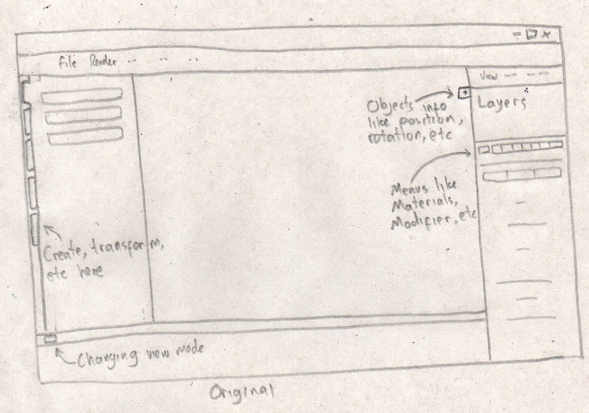
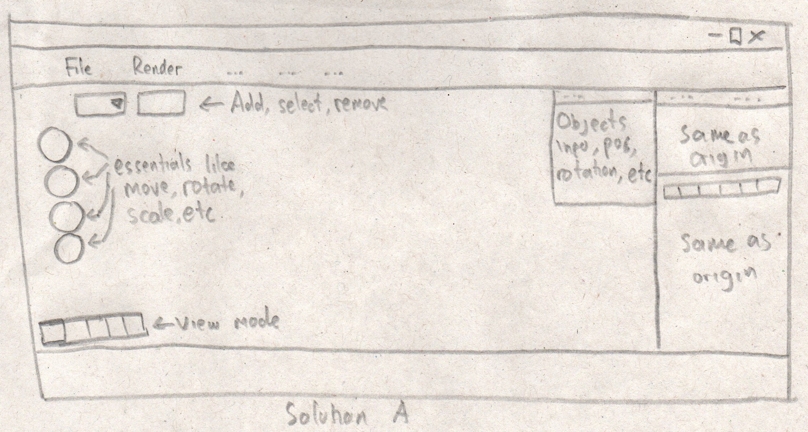
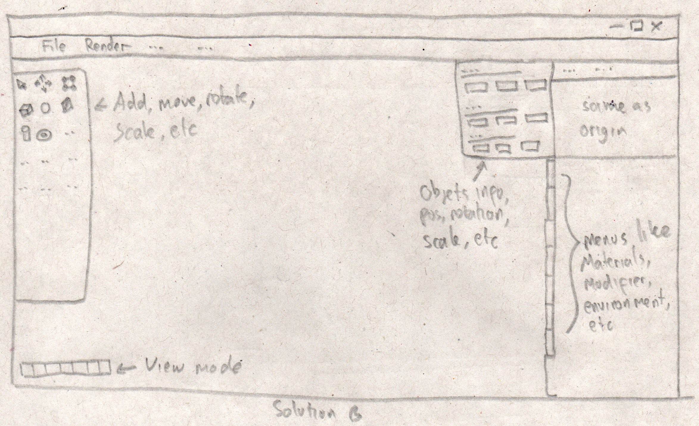
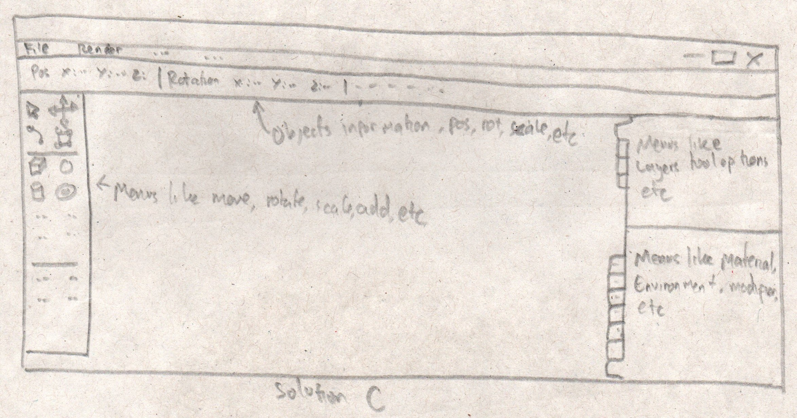

# Sketching and Prototyping
Using the information in the results of Assignment 1 for what is good and bad about the UI for designed tasks, we are going to make **Sketches** and **Prototypes**. These sketches and prototypes will lead to better design in Assignment 3. The prototypes will be then tested through a usability evaluation followed by design revision in Assignment 4.

## Part A: Sketches
Sketch at least **3 (three)** different UIs for the functions you are targeting. These three interfaces should be _dramatically different_ in terms of design directions. For example, they can be with different organizations of what functions on each screen or using a different layout of the icons, widgets, and menus on the screens. If you want, you can also incorporate non-on-screen UIs: physical buttons, gestures through motion sensors, etc.

You need **not** sketch the whole interface. It is not necessary for the sketches to have every function or every function in detail, but there should be enough to show off your general idea. **Be creative!** Draw your idea and label a few of the widgets so we can tell your intent. The goal is to have at least 3 good UIs in *interesting* ways. Sketches should be done on paper with pens and/or pencils (do not use a computer).

### 1. Scan/Photo of Sketches

### 2. Version Differences

#### Original

The original User Interface seems to "hide" a function that often used by user when 3d modelling like Add object, Move, Rotate. In the original design its located at the left toolbar, what makes it hard to be seen is the option is located at the left side of the toolbar which many people won't recognize it at the first glance. User eyes will be focused on the center of the screen because its where the canvas we are working in placed. So when user looks for the add button which is in the "Create" bar in the left toolbar, they will search in the toolbar first then because its not there, they will looks for it in another place. The user in my Contextual Inquiry do that, until she realize that there is a small text "Create" beside the toolbar on the left.

Second is the object's information placement. You won't know where does the information of the object you select because its hidden in default. You should click a button for the toolbar to appear on screen. And the button is the small button beside the right side toolbar with the plus sign in it. Its very small you won't know what its used for.

Third is the button to change the view mode, to change from object mode, shader mode, etc you must click a very small button with meaningless icon on the bottom left toolbar. Clearly you wont know this except you have search for it for a long time or googling it.

Fourth is the menus like materials, render mode, environment, modifier, etc is listed with icon as representative. And begginers doesn't know what is that icon meaning so if they want to add material they will click randomly hoping that it is the material icon then try again if its not.

Fifth is there is an animation toolbar on the bottom screen

Sixth is there is a layer toolbar at upper right screen

#### Solution A

In Solution A I focused on making the button user often uses when 3d modelling to be more visible to the user. First of all i remove the left toolbar because its too much useless information for the start. Then buttons like move, rotate, scale, add, select, remove have each button floating in upper left screen. The purpose is so user can see it better.

And the object's information toolbar is visible by default, so user doesn't have to click a "hidden" button to see it.

View mode is not a dropdown menu again.

#### Solution B

In Solution B I use a left toolbar but its noting like the original design have. Its more like the style of adobe products (photoshop, after effect, etc). So the toolbar have the icon of tools like move, add, scale, rotate, etc.

The button for selecting menus like material, modifier, etc is designed like book marker and it uses text instead of icons. I know that it is the look the same as the original design of left toolbar for create, transform, etc. But the button for selecting it is on the right side of toolbar so its in the same area as the main canvas, not hidden on the side of the screen.

The animation toolbar is set to hidden in default because user will have to design a 3d model first rather than animating first.

#### Solution C

In solution C, same as B, there is a left toolbar like adobe style

The objects information is placed at the top screen under the main menubar. I think if its this way, the user will have a better looks for the canvas they are working in, unlike when its a bos at the upper right screen.

Then the layer toolbar at the upper right is added with other function that we will use like Tool option, etc.

Same as B, the animation toolbar is hidden in default to give user better vision of the canvas

### 3. Selected Sketch

Given the solutions I made, I will take the **Solution C**, because it makes important tools more visible, making the canvas more "large" by removing unnecessary toolbar. And it gives more option for tools, like tool option, etc

### 4. Design Rationale

Based on my last assignment, the user is hard to search for a button she is looking for. Because the design is like "hiding" those button and its more easier to remember a keyboard shortcuts rather than searching for a button (which is also hard to remember all those keyboard shortcuts). So I try to make button that is often used by user to be more visible, and removing away any button or toolbar that is not necessary for 3d modelling at the start.

## Part B: Assumptions
### 1. Hardware

- Operating System : Windows / Linux
- Screen size : 15.6 inch
- Screen Resolution : HD (720p) or higher with screen ration of 16:9
- Input : Keyboard and Mouse
- Screen Color : RGB

### 2. Users

User is expected to be familiar in handling a desktop application. User can use mouse and keyboard well enough. The user should know what will they do when 3d modelling (like "I want to make a House so I should make a box, then add a Triangle Prism as Roof, etc"). User understand English well enough. User expected to be 13 years or older for them knowing what to do and familiar with technologies.

## Part C: Prototypes
We will work on this part together during the class on **March 22nd, 2019**, 10:00 AM - 12.30 PM. Therefore, prior to the class please complete all the above parts (A & B) beforehand accordingly.

